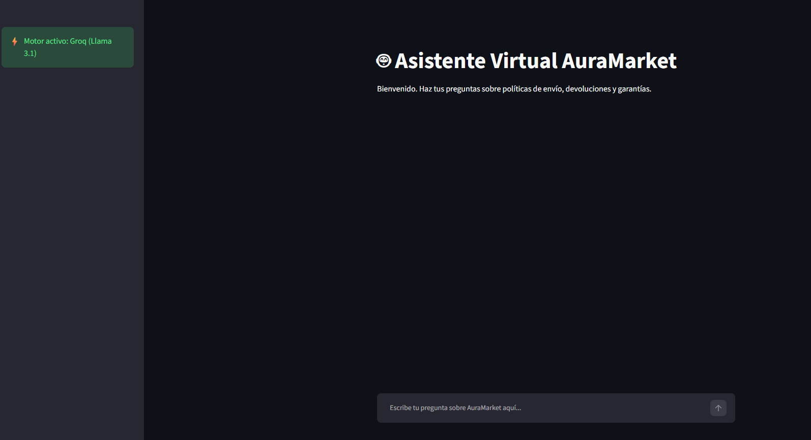
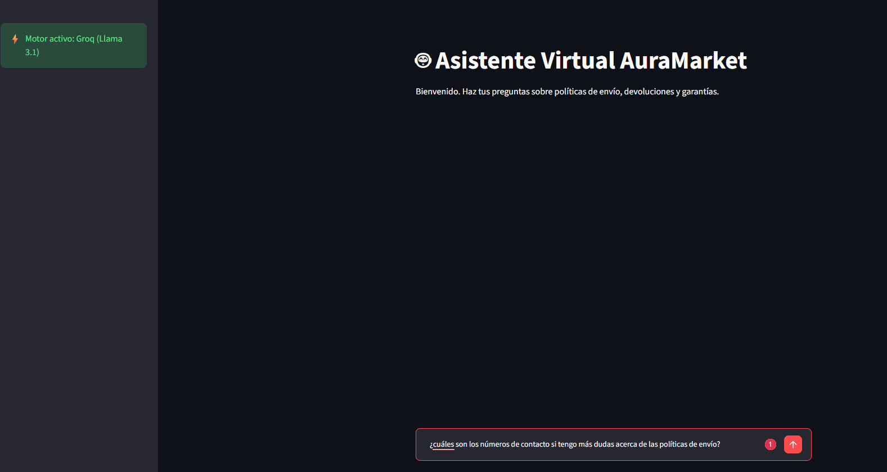
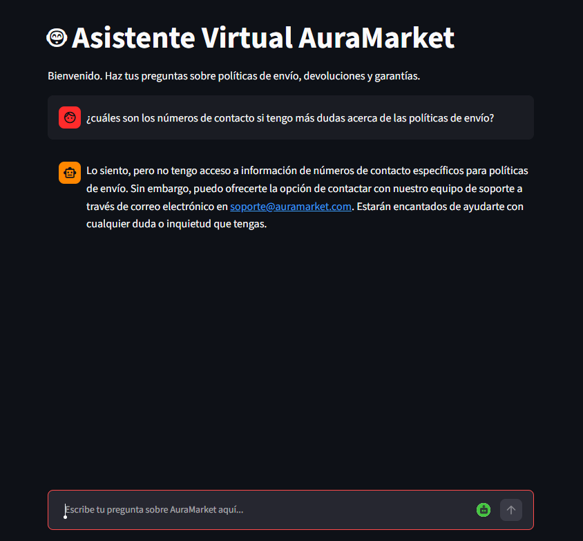
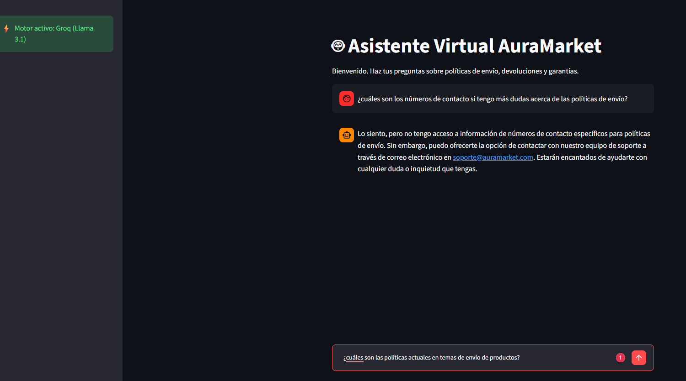
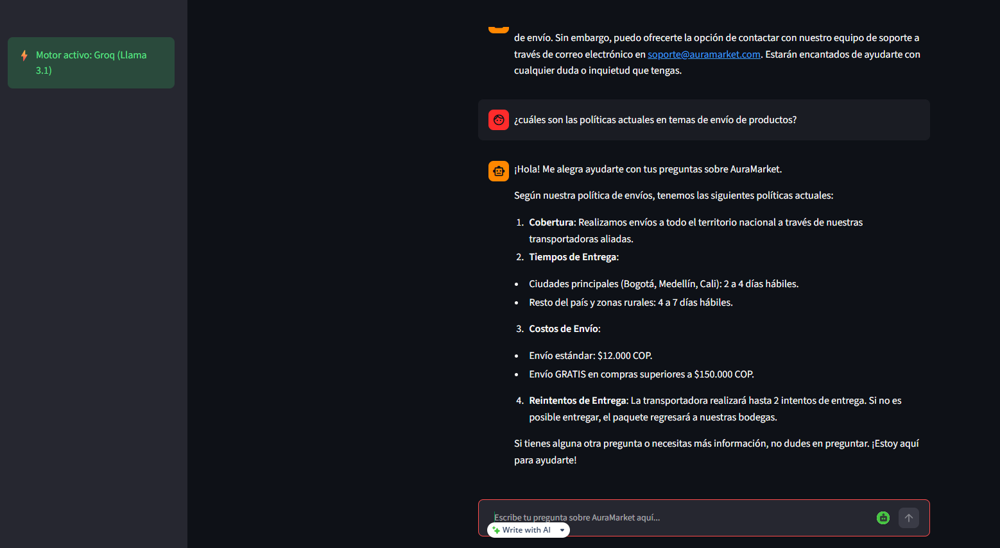
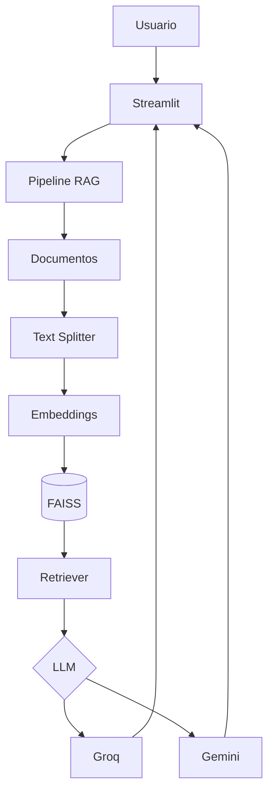

# 🤖 Asistente Virtual Corporativo AuraMarket

> Sistema inteligente de atención al cliente basado en **RAG (Retrieval-Augmented Generation)** desarrollado con **Streamlit**, **LangChain**, **FAISS** y modelos **Groq Llama 3.1** y **Google Gemini 2.0 Flash**.

## 🚀 Probar la aplicación

🌐 **Aplicación en línea**

👉 https://challenge-aluralatam-agente-2026.streamlit.app/

Puedes hacer preguntas sobre:

- Envíos
- Garantías
- Devoluciones
- Preguntas frecuentes
- Términos y condiciones

## 📑 Tabla de Contenidos

- [🤖 Asistente Virtual Corporativo AuraMarket](#-asistente-virtual-corporativo-auramarket)
  - [🚀 Probar la aplicación](#-probar-la-aplicación)
  - [📑 Tabla de Contenidos](#-tabla-de-contenidos)
  - [📋 Descripción General](#-descripción-general)
  - [📸 Demostración e Interfaz](#-demostración-e-interfaz)
    - [Pantalla principal](#pantalla-principal)
    - [Realizar una pregunta](#realizar-una-pregunta)
    - [Respuesta del agente](#respuesta-del-agente)
    - [Continuación de la conversación](#continuación-de-la-conversación)
    - [Segunda respuesta del agente](#segunda-respuesta-del-agente)
  - [📌 Tipos de consultas soportadas](#-tipos-de-consultas-soportadas)
      - [📦 Guía de Envíos y Entregas](#-guía-de-envíos-y-entregas)
      - [🔄 Política de Devoluciones y Reembolso](#-política-de-devoluciones-y-reembolso)
      - [🔐 Política de Privacidad y Tratamiento de Datos](#-política-de-privacidad-y-tratamiento-de-datos)
      - [❓ Preguntas Frecuentes (FAQ)](#-preguntas-frecuentes-faq)
      - [📄 Términos y Condiciones Generales](#-términos-y-condiciones-generales)
  - [✨ Características Principales](#-características-principales)
  - [🏗️ Arquitectura del Sistema](#️-arquitectura-del-sistema)
  - [🔄 Flujo de Funcionamiento (RAG Engine)](#-flujo-de-funcionamiento-rag-engine)
  - [⚡ Tecnologías Principales](#-tecnologías-principales)
  - [📁 Estructura del Proyecto](#-estructura-del-proyecto)
  - [📄 Cobertura de Documentación de AuraMarket](#-cobertura-de-documentación-de-auramarket)
  - [🛠️ Instalación y Ejecución Local](#️-instalación-y-ejecución-local)
  - [🧪 Diagnóstico y Pruebas Automatizadas](#-diagnóstico-y-pruebas-automatizadas)
  - [🤖 Modelos de LLM y Embeddings Soportados](#-modelos-de-llm-y-embeddings-soportados)
  - [🚀 Roadmap y Mejoras Futuras](#-roadmap-y-mejoras-futuras)
  - [📝 Licencia](#-licencia)

---

## 📋 Descripción General

AuraMarket es un asistente virtual diseñado para responder consultas sobre envíos, devoluciones, garantías, privacidad y preguntas frecuentes utilizando una arquitectura **RAG**.

> [!NOTE]
> El asistente responde únicamente con base en la documentación corporativa indexada para reducir respuestas inventadas.

## 📸 Demostración e Interfaz

### Pantalla principal



### Realizar una pregunta



### Respuesta del agente



### Continuación de la conversación



### Segunda respuesta del agente



## 📌 Tipos de consultas soportadas

El asistente virtual AuraMarket responde preguntas basándose exclusivamente en la documentación corporativa indexada en su base de conocimiento. Actualmente puede resolver consultas relacionadas con los siguientes documentos:

#### 📦 Guía de Envíos y Entregas

Ejemplos de consultas:

- ¿Cuánto tarda en llegar un pedido a Medellín?
- ¿Qué ciudades tienen cobertura de envío?
- ¿Cuáles son los costos de envío?
- ¿A partir de qué valor el envío es gratuito?
- ¿Cómo puedo hacer seguimiento a mi pedido?

---

#### 🔄 Política de Devoluciones y Reembolso

Ejemplos de consultas:

- ¿Cuánto tiempo tengo para solicitar una devolución?
- ¿Qué condiciones debe cumplir un producto para ser devuelto?
- ¿Cómo solicito un reembolso?
- ¿Cuánto tarda el proceso de devolución?
- ¿Qué productos no son elegibles para devolución?

---

#### 🔐 Política de Privacidad y Tratamiento de Datos

Ejemplos de consultas:

- ¿Cómo protege AuraMarket mis datos personales?
- ¿Qué información personal recopila la empresa?
- ¿Cómo solicito la actualización o eliminación de mis datos?
- ¿Durante cuánto tiempo conservan mi información?
- ¿Cuáles son mis derechos como titular de los datos?

---

#### ❓ Preguntas Frecuentes (FAQ)

Ejemplos de consultas:

- ¿Qué métodos de pago acepta AuraMarket?
- ¿Cómo puedo recuperar mi contraseña?
- ¿Cómo contacto al servicio al cliente?
- ¿Puedo modificar un pedido después de realizar la compra?
- ¿Cómo consulto el estado de mi pedido?

---

#### 📄 Términos y Condiciones Generales

Ejemplos de consultas:

- ¿Cuáles son las condiciones generales de compra?
- ¿Qué responsabilidades tiene AuraMarket como vendedor?
- ¿Cuáles son las obligaciones del cliente?
- ¿Qué limitaciones de responsabilidad existen?
- ¿Cómo se gestionan las garantías de los productos?

---

> [!IMPORTANT]
> Todas las respuestas son generadas mediante una arquitectura **Retrieval-Augmented Generation (RAG)**. Antes de responder, el sistema recupera los fragmentos más relevantes de la documentación corporativa y utiliza ese contexto para generar una respuesta precisa y fundamentada.

> [!NOTE]
> Si una consulta no está relacionada con la documentación disponible (por ejemplo, preguntas sobre deportes, política, actualidad o temas ajenos a AuraMarket), el asistente indicará que no dispone de información suficiente para responder y sugerirá contactar al equipo de soporte cuando corresponda.

## ✨ Características Principales

- Arquitectura RAG con FAISS.
- Embeddings HuggingFace (`all-MiniLM-L6-v2`).
- Fallback automático entre Groq y Gemini.
- Caché de recursos con Streamlit.
- Historial conversacional.
- Diagnóstico automático mediante `test_agente.py`.

## 🏗️ Arquitectura del Sistema



## 🔄 Flujo de Funcionamiento (RAG Engine)

1. Carga de documentos.
2. Segmentación (Chunking).
3. Vectorización mediante HuggingFace.
4. Indexación en FAISS.
5. Recuperación de contexto.
6. Generación de respuesta con Groq o Gemini.

## ⚡ Tecnologías Principales

| Componente | Tecnología |
|------------|------------|
| Frontend | Streamlit |
| Framework RAG | LangChain |
| Vector DB | FAISS |
| Embeddings | all-MiniLM-L6-v2 |
| LLM | Groq Llama 3.1 / Gemini 2.0 Flash |
| Lenguaje | Python 3.10+ |

## 📁 Estructura del Proyecto

```text
AuraMarket-Agent/
├── docs/
├── app.py
├── test_agente.py
├── .env
├── .env.example
├── README.md
└── requirements.txt
```

## 📄 Cobertura de Documentación de AuraMarket

| Documento | Contenido |
|-----------|-----------|
| guia_envios.txt | Envíos y tiempos |
| politica_devoluciones.txt | Devoluciones |
| politica_privacidad.txt | Protección de datos |
| preguntas_frecuentes.txt | FAQ |
| terminos_condiciones.txt | Condiciones |

## 🛠️ Instalación y Ejecución Local

```bash
git clone https://github.com/tu-usuario/auramarket-agent.git
cd auramarket-agent

python -m venv venv

# Windows
venv\Scripts\activate

# Linux/macOS
source venv/bin/activate

pip install -r requirements.txt

streamlit run app.py
```

## 🧪 Diagnóstico y Pruebas Automatizadas

```bash
python test_agente.py
```

El script verifica:

- API Keys.
- Lectura de documentos.
- Chunking.
- Embeddings.
- FAISS.
- Conectividad con el LLM.

## 🤖 Modelos de LLM y Embeddings Soportados

| Componente | Modelo |
|------------|--------|
| Embeddings | all-MiniLM-L6-v2 |
| Vector DB | FAISS |
| LLM Principal | llama-3.1-8b-instant |
| LLM Secundario | gemini-2.0-flash |

## 🚀 Roadmap y Mejoras Futuras

- Soporte para PDF y DOCX.
- Persistencia del índice FAISS.
- Despliegue en la nube.
- Evaluación RAG con Ragas.

## 📝 Licencia

Desarrollado para el sistema de atención al cliente de AuraMarket.

© 2026 AuraMarket. Todos los derechos reservados.